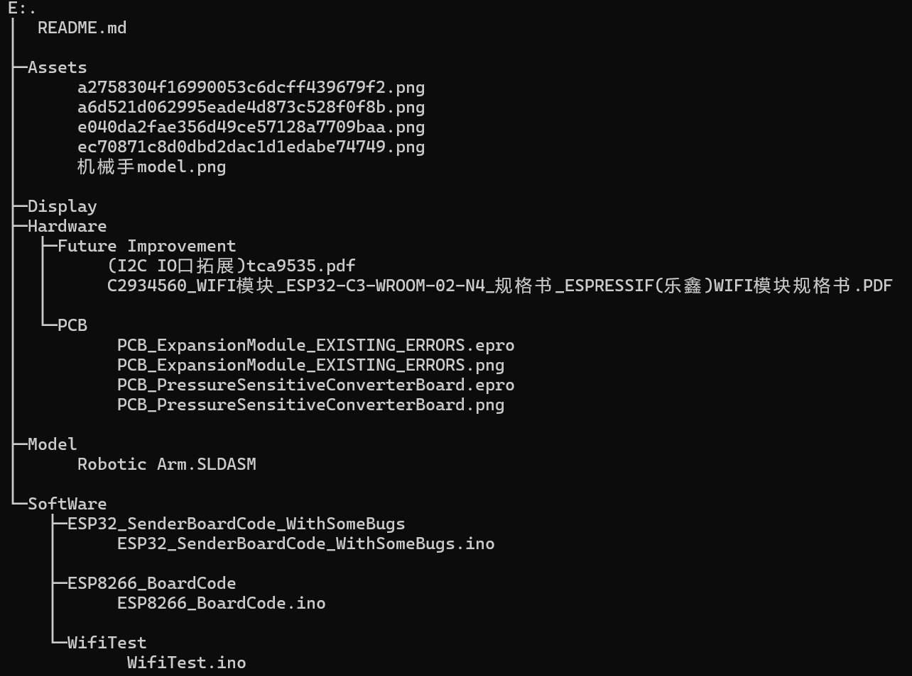
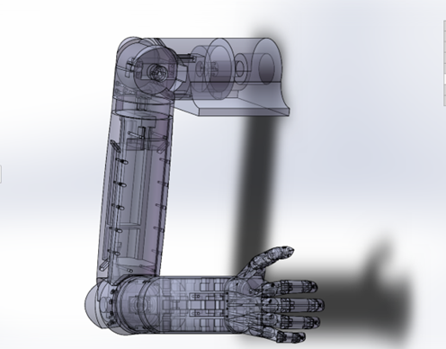
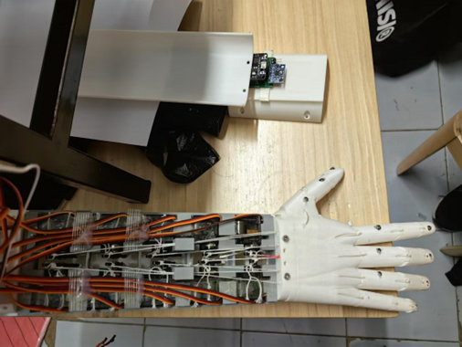
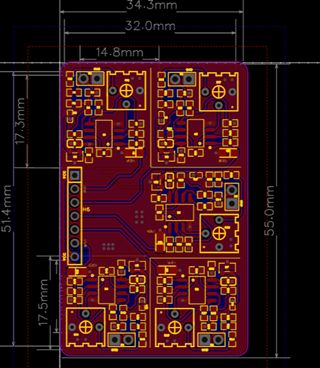
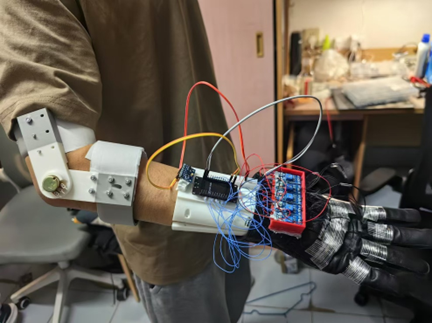

# 总体介绍
本项目为清华大学电子工程系第27届硬件设计大赛一等奖作品——First机械手 (First Robotic Arm)

**README文档还在更新中**

#### 亮点：
1. 线驱动机械手
2. 大扭矩舵机（尽可能好的控制机械臂）
3. 设计集成度较高的压敏电阻测量模块(PCB)
4. 设计拓展版(PCB)实现更集成的功能、更美观和更高的稳定性
5. 10通道测量,更精确地测量各个关节角度
6. 使用K210实现手势识别,输出数据控制机械手
7. 使用电位计和MPU6050分别测量手肘旋转角度和小臂自转角度

#### 不足：
1. 机械手手指扭矩力道不足,精度不够高
2. 压敏电阻转换非线性,目前只能进行0-1输出
3. ESP32使用WIFI时会导致板载ADC2通道引脚失效,可以使用IO拓展增加ADC引脚
4. 设计的拓展板尺寸稍有不对,宽度大概多了1mm左右
5. K210和ESP8266的通讯很棘手,还没有完成

#### 未来可以改进的方向：
1. 显然换成电机控制会让机械臂效果好很多
2. 10自由度--5自由度机械手已经可以完成大部分日常工作
3. 压敏电阻使用反比例函数模型进行数据拟合，获得更好的效果  (大概x)

# 本Proj文件树结构:
**截止2024/9/21**

# 本项目详细介绍
### 1. 机械结构+舵机安装
由whj同学进行多版机械手+机械臂结构设计以及舵机的安装。

整个过程很复杂，尤其是舵机的布线 (我们最终选择风筝线作为固定线，兼具一定的弹性和大拉力) 以及3D打印的设计需要对尺寸很强的把握。

我们总共打印了5~6版结构，最终实现了比较好的整体效果

### 2. CNN
由ykp同学进行CNN架构搭建和本地跑一个轻量化CV模型，实现了基本的手势分类，准确率达到90%以上(至少显示的如此，具体使用中因为摄像范围、帧数限制等原因会降低其识别准确率)。

将这个轻量化模型部署到K210上(这里K210自带的Flash已经不足以支持这些参数的模型，所以使用了SD卡扩容)

PS: SD卡也是一个很容易出现Bug的地方（悲）

### 3. 传感模块（by Lucas Song）
我创新性的使用了压敏电阻检测手指关节弯曲程度，原理很简单：将压敏电阻紧贴在手指关节处，当手指关节弯曲时，会对手指关节处的压敏电阻产生一个压力，改变其电阻阻值，从而实现从弯曲角度到电阻阻值的转化。

当然，最初方案不是这样，最初我使用的是应变片，这个不仅贵（一小片要十几块钱,我当时斥巨资买了120元的,最后一个没用上x）,变化范围极小（350±2Ω）,而且非常脆弱（根部不小心就断了）。这个"spider"方案耗费了我们1~2周时间，期间sxz同学一直在为其绘制PCB版，但是最终因为GND打孔问题导致PCB失败，整体方案替换为现在的压敏电阻。

压敏电阻变化范围非常大：KΩ~MΩ量级变化，可以说非常适合本次任务。
唯一美中不足的是使用压敏电阻可能需要数据拟合才能得到较为正确的实时角度值，但是因为时间原因以及技术复杂度，我们最终选择的是进行范围分割，只输出0、90、-1（表示无效数据）三个值只做最简单的控制。

下图是我最开始给应变片方案设计的PCB采集电路(还花了我不少钱去买运放 (生气) )

更改方案2之后我们先是使用淘宝上买的器件做了一个小Demo(下图) ，并且用它参与了初试

后面sxz同学的主要工作就是优化传感部分的结构：打了一个新传感模块+一个拓展板。以及优化整体的数据获取+通信模块。

**anecdote**:在决赛的前一天晚上才焊好所有板子并开始编写手指--机械手部分的控制代码，最终耗费一上午也是勉强赶上DDL了（）。这个故事告诉我们做事不要拖，不然会很破防（确信）

以及我要狠狠吐槽ESP32打开WiFi之后ADC2通道的所有引脚模拟量测量失效，1天半基本都是在怼这个问题，我开始甚至不知道，一直以为是自己的拓展板设计错了（悲）。

